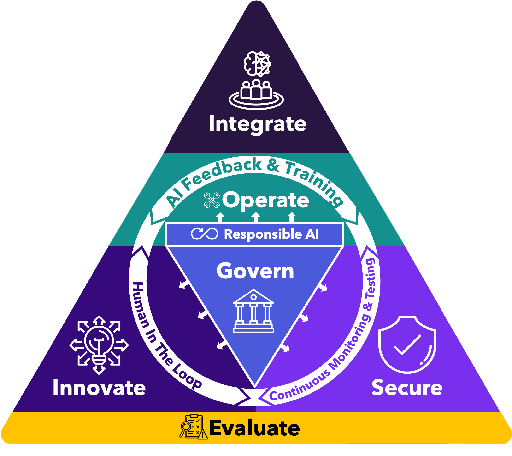

### AI Adoption and Management Framework (AI-AMF)

The AI Adoption and Management Framework (AI-AMF), developed by WhiteGloveAI, is a 
transformative methodology that guides organizations from the conceptualization of AI to full-scale 
operational integration. The framework is characterized by a multi-layer, systematic approach 
ensuring that enterprises align with evolving industry standards such as ISO 42001, NIST AI RMF, 
OWASP guidelines, MITRE frameworks, the EU AI Act, and Databricks’ AI Security Framework (DASF). 
Leveraging the innovative vCAIO (virtual/fractional Chief AI Officer) model, the AI-AMF not only 
supports technical and operational excellence but also addresses key strategic, ethical, and 
governance challenges.

[AI-AMF Practitioners Guide](AI%20Adoption%20Management%20Framework%20Guide.pdf)

#### License: Creative Commons Attribution-ShareAlike 4.0 International

**Canonical URL**: [https://creativecommons.org/licenses/by-sa/4.0/](https://creativecommons.org/licenses/by-sa/4.0/)

You are free to:  
- **Share** — copy and redistribute the material in any medium or format for any purpose, even commercially.  
- **Adapt** — remix, transform, and build upon the material for any purpose, even commercially.  

The licensor cannot revoke these freedoms as long as you follow the license terms.

**Under the following terms**:  
- **Attribution** — You must give appropriate credit, provide a link to the license, and indicate if changes were made. You may do so in any reasonable manner, but not in any way that suggests the licensor endorses you or your use.  
- **ShareAlike** — If you remix, transform, or build upon the material, you must distribute your contributions under the same license as the original.  
- **No additional restrictions** — You may not apply legal terms or technological measures that legally restrict others from doing anything the license permits.
